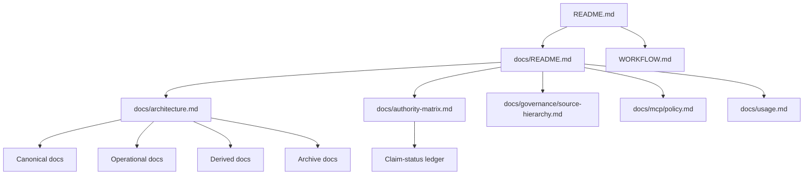
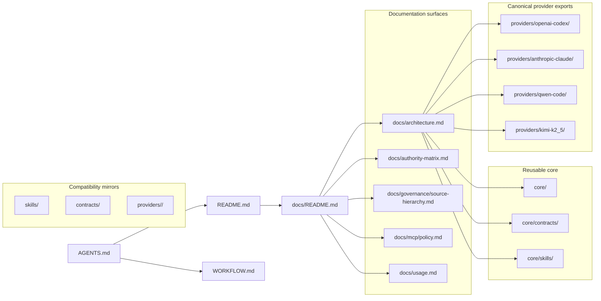

# Documentation Architecture Charter

Class: canonical.
Use rule: read this first for documentation hierarchy, class definitions, merge rules, and update rules; treat it as logical structure only, not a physical directory map.

This file is the canonical documentation operating charter for the repository.
It is prose authority, not script-enforced truth. When a validator or script disagrees with this file, the validator or script is the enforcement surface and [authority-matrix.md](authority-matrix.md) records the claim status.

## Objective

Define how repository docs are classified, where authority lives, and how updates merge without duplicating truth.

## Authority Tiers

| Tier | Class | Meaning | Examples |
| --- | --- | --- | --- |
| 0 | enforced | Script- or validator-backed truth. This is the highest executable authority. | `scripts/tools/validate-shared-core-package.mjs`, `scripts/tools/validate-shared-core-scaffold.mjs`, `scripts/tools/validate-consumer-linkage.mjs` |
| 1 | canonical | Normative repo docs that define policy, contracts, and architecture. | `AGENTS.md`, `WORKFLOW.md`, `docs/authority-matrix.md`, `docs/compatibility.md`, `docs/governance/source-hierarchy.md`, `docs/lock-model.md`, `docs/mcp/policy.md`, `docs/repo-overlay-contract.md`, `docs/secret-handling.md`, `docs/shared-with-local-inputs.md`, `docs/repo-intake-skill-contract.md`, `docs/runtime-policy-skill-contract.md`, `docs/portability.md`, `docs/provider-capability-matrix.md`, `docs/workflows/README.md`, `core/README.md`, `core/contracts/README.md` |
| 2 | operational | Runbooks, usage guides, command references, checklists, and authoring guides that depend on canonical rules. | `docs/README.md`, `docs/usage.md`, `docs/adoption-playbook.md`, `docs/consumer-rollout-playbook.md`, `docs/maintainer-commands.md`, `docs/validation-checklist.md`, `docs/authoring-guides.md`, `evals/README.md` |
| 3 | derived | Summaries, baselines, examples, and templates that explain or demonstrate current practice. | `docs/overview.md`, `docs/eval-baseline.md`, `templates/codex-workflow/*`, `examples/codex-workflow/*` |
| 4 | archive | Historical or frozen planning records. | `docs/extraction-roadmap.md`, `CHANGELOG.md` |

## Current Repo Shape

- Root governance: `AGENTS.md`
- Root workflow entry: `WORKFLOW.md`
- Front door: `README.md`
- Docs index: `docs/README.md`
- Canonical docs: `docs/authority-matrix.md`, `docs/architecture.md`, `docs/compatibility.md`, `docs/governance/source-hierarchy.md`, `docs/lock-model.md`, `docs/mcp/policy.md`, `docs/repo-overlay-contract.md`, `docs/secret-handling.md`, `docs/shared-with-local-inputs.md`, `docs/repo-intake-skill-contract.md`, `docs/runtime-policy-skill-contract.md`, `docs/portability.md`, `docs/provider-capability-matrix.md`, `docs/ui-ux-composition-branch.md`
- Canonical workflow deep-dive docs: `docs/workflows/README.md`, `docs/workflows/implementation-and-handoff.md`, `docs/workflows/verification-and-certification.md`
- Canonical machine-readable tool catalog: `core/contracts/tool-contracts/catalog.json`
- Canonical machine-readable workflow mapping: `core/contracts/workflow-routing-map.json`
- Compatibility/export tool catalog: `docs/tool-contracts/catalog.json`
- Machine-readable neutral registry: `core/contracts/core-registry.json`, `core/contracts/provider-capabilities.json`
- Machine-readable policy surfaces: `policies/secret-classes.yaml`, `policies/tool-capabilities.yaml`
- Portable core slice: `core/`
- Provider adapter scaffolds: `providers/`
- Operational docs: `docs/README.md`, `docs/usage.md`, `docs/adoption-playbook.md`, `docs/consumer-rollout-playbook.md`, `docs/maintainer-commands.md`, `docs/validation-checklist.md`, `docs/authoring-guides.md`, `evals/README.md`
- Evals surface: `evals/`
- Derived docs and support surfaces: `docs/overview.md`, `docs/eval-baseline.md`, `docs/ui-ux-composition/*`, `templates/codex-workflow/*`, `examples/codex-workflow/*`
- Archive: `docs/extraction-roadmap.md`, `CHANGELOG.md`
- Enforcement surfaces: `scripts/tools/*`
- Logical class model only: the repo does not currently use physical `canonical/`, `operational/`, `derived/`, or `archive` subdirectories.

## Documentation Topology

## Repository Surface Map

## Skill Topology

- Portable exported skills live in `core/skills/`. They are reusable, versioned, and safe to project into provider bundles when their boundaries remain generic and explicit.
- `core/skills/ui-ux-composition/` is the canonical operational skill surface for the UI/UX composition branch.
- The `ui-ux-composition` branch explicitly includes semantic visual direction, semantic layout posture, semantic color posture, tone-aware typography posture, and bounded golden-ratio heuristics.
- `core/skills/static-vs-dynamic-rendering-advisor/` is a bounded sibling skill for rendering posture advice (`static`, server-rendered dynamic, hydration) and is separate from visual composition authority.
- Legacy shared exported skills live in `skills/` as compatibility surfaces until the migration is complete.
- Contract-bound skills still live in `skills/` when the only repo-specific dependency is an explicit local input contract. The boundary is the declared contract, not the directory name.
- Canonical provider-specific packaging and prompt compilation live in `providers/openai-codex/`, `providers/anthropic-claude/`, `providers/qwen-code/`, and `providers/kimi-k2_5/`. Legacy provider directories remain compatibility mirrors.
- Repo-local control-plane skills live in `.agents/skills/`. They govern routing, reuse-vs-create policy, and other repo-specific meta-decisions only.
- `skill-tool-mcp-builder` is the repo-local control-plane skill that classifies loose requests into surface type decisions before deeper routing or creation work happens.
- Docs and contracts are the home for truth declarations, authority rules, and input-contract surfaces. If a workflow mainly declares scope, authority, or local input shape, keep it in docs/contracts instead of promoting it to a skill.
- The skill class model is logical only; it does not imply a physical directory split beyond the current repository layout.

## Phase 1 Overlay Mapping

- The full model-agnostic workflow spec is adopted here as an overlay on the current canonical repo layout.
- Root workflow entry and authority order live in `WORKFLOW.md`, `docs/governance/source-hierarchy.md`, and `docs/mcp/policy.md`, not in a second spec-shaped directory tree.
- Canonical machine-readable workflow/tool/provider truth remains under `core/contracts/`.
- Compatibility mirrors remain explicit in `skills/`, `contracts/`, legacy `providers/*`, and `docs/tool-contracts/catalog.json`.
- Validator-backed enforcement remains under `scripts/tools/`; prose docs must not imply runtime or validator maturity that the scripts do not prove.

## Phase 2 Overlay Mapping

- Workflow-class to skill/tool/MCP/output/validation linkage is now canonically modeled in `core/contracts/workflow-routing-map.json`.
- Canonical skill discoverability posture remains rooted in `core/contracts/portable-skill-manifest.json` and is projected into `core/contracts/core-registry.json`.
- `core/contracts/core-registry.json` now includes a workflow mapping projection to keep routing/discovery inspection in one validator-backed registry snapshot.
- `docs/workflows/README.md` is a canonical deep-dive entrypoint and does not replace `WORKFLOW.md` root taxonomy authority.

## Phase 3 Overlay Mapping

- Workflow routing now includes explicit evidence and completion posture fields (`requiredEvidenceArtifacts`, `completionPosture`) in `core/contracts/workflow-routing-map.json`.
- Canonical output contracts now include bounded execution evidence artifacts (`workflow-validation-summary-v1`, `workflow-certification-summary-v1`) in `core/contracts/output-contracts.json`.
- Provider exports now project canonical source-contract ownership and workflow/skill evidence metadata via `scripts/tools/build-provider-exports.mjs`.
- Certification coverage now includes workflow evidence posture and provider export alignment fixtures under `evals/fixtures/`.
- Repo-root `memory/` remains intentionally `planned`; this slice does not introduce a runtime memory subsystem.

## Phase 4 Overlay Mapping

- Operator-facing templates under `templates/codex-workflow/` are explicitly linked to canonical workflow/output contracts and remain artifact scaffolds rather than authority replacements.
- `core/contracts/workflow-routing-map.json` now carries template linkage per workflow class via `recommendedTemplates`.
- `core/contracts/output-contracts.json` now carries template linkage for workflow evidence artifacts via `recommended_templates`, including `workflow-handoff-summary-v1`.
- `docs/workflows/` now includes bounded class-level deep dives for implementation/handoff and verification/certification without redefining root taxonomy.
- Cross-surface validator and eval checks are extended to keep template/workflow/output linkage aligned across registry and provider exports.

## Phase 5 Overlay Mapping

- Workflow-class entries in `core/contracts/workflow-routing-map.json` now declare bounded example linkage and explicit coverage labels (`workflowClassCoverage`, `workflowClassCoverageNotes`, `exampleArtifacts`).
- Skill-to-workflow/tool/output/template/example alignment is projected into the neutral registry and provider exports via derived `workflowSupport` metadata on each skill record.
- Examples under `examples/codex-workflow/` are tightened as derived, contract-aligned portability artifacts and indexed in `examples/codex-workflow/README.md`.
- Validators and certification fixtures are extended to enforce workflow coverage fields, example-link integrity, and exported skill workflow-support metadata consistency.

## Phase 6 Overlay Mapping

- Provider capability contracts now carry explicit portability-minimized vocabulary metadata and projection policy in `core/contracts/provider-capabilities.json`.
- Provider exports now carry explicit capability ownership metadata that points to canonical provider-capability contracts and derived-only projection policy.
- Secret-boundary enforcement now validates provider-export secret metadata and integrates blocking leak-scan results from `scripts/tools/scan-secrets.mjs`.
- Provider-export certification alignment now validates capability ownership metadata and normalized capability-state values in addition to workflow/skill alignment checks.

## Phase 7 Overlay Mapping

- Authoring and onboarding guidance is tightened in existing operational surfaces (`README.md`, `docs/README.md`, `docs/authoring-guides.md`, `docs/validation-checklist.md`) instead of introducing a new doc family.
- Canonical extension ergonomics for skills and contracts is made explicit in `core/skills/README.md` and `core/contracts/README.md`, with direct linkage to existing validator/eval gates.
- Template/example extension posture is tightened in `templates/codex-workflow/README.md` and `examples/codex-workflow/README.md` so derived operator artifacts remain projections of canonical contracts.
- Drift prevention for authoring guidance is partly validator-backed through required heading checks in `scripts/tools/validate-shared-core-scaffold.mjs`.

## Phase 8 Overlay Mapping

- Consumer adoption and rollout guidance is tightened in existing operational docs (`README.md`, `docs/README.md`, `docs/adoption-playbook.md`, `docs/consumer-rollout-playbook.md`) with bounded migration/handoff steps.
- Compatibility governance is tightened in canonical docs (`docs/compatibility.md`) and boundary indexes (`contracts/README.md`, `providers/README.md`) without introducing a second migration framework.
- Compatibility tool-catalog metadata explicitly marks `docs/tool-contracts/catalog.json` as compatibility/export with canonical source linkage.
- Drift prevention for consumer/compatibility guidance is strengthened via additional required heading checks in `scripts/tools/validate-shared-core-scaffold.mjs` and compatibility metadata checks in `scripts/tools/validate-provider-neutral-core.mjs`.

## Phase 9 Overlay Mapping

- Release posture and adoption-readiness guidance is tightened in existing entry/checklist/command surfaces (`README.md`, `docs/README.md`, `docs/validation-checklist.md`, `docs/maintainer-commands.md`).
- Operational auditability is strengthened by explicit release-critical canonical-vs-derived scope and bounded certification handoff requirements in `docs/compatibility.md`, `docs/adoption-playbook.md`, and `docs/consumer-rollout-playbook.md`.
- Compatibility tool-catalog release metadata is tightened in `docs/tool-contracts/catalog.json` with validator-backed enforcement in `scripts/tools/validate-provider-neutral-core.mjs`.
- Drift detection for release-critical prose surfaces is strengthened through additional required heading checks in `scripts/tools/validate-shared-core-scaffold.mjs`.

## Phase 10 Overlay Mapping

- Canonical extension contracts now include OBS, PBC, WMC, MAHP, RGC, and TSC surfaces under `core/contracts/`.
- Portable manifest module declarations in `core/contracts/portable-skill-manifest.json` now carry opt-in/deferred extension posture for all six modules.
- Deterministic module eval slices exist for all six modules (`eval:obs`, `eval:pbc`, `eval:wmc`, `eval:mahp`, `eval:rgc`, `eval:tsc`) as validator-backed candidates only.
- Compatibility posture remains non-breaking: no global consumer-blocking gate or mandatory migration is introduced by these module slices.
- Runtime and enforcement layers remain explicitly out of scope in this phase (no sink/exporter, scheduler, memory store, permission engine, handoff transport, or budget runtime engine).

## Capability Maturity Labels

When a doc in this repo describes capability maturity, it should distinguish:

- `prose-governed`
- `contract-backed`
- `validator-backed`
- `runtime-implemented`

These labels describe maturity only. They do not replace the claim-status ledger in `docs/authority-matrix.md`.

## Merge and Update Rules

1. Keep one canonical home per rule or contract.
2. If two files describe the same normative rule, merge that rule into the canonical file and leave the secondary file as a pointer or short appendix.
3. Operational docs may summarize flows, but they must point back to the canonical rule instead of redefining it.
4. Derived docs may restate current practice only if they are labeled derived and link back to the canonical source.
5. Archive docs are append-only except for factual corrections.
6. If enforcement changes, update the validator or script and the canonical doc in the same slice.
7. If a new doc is needed, justify it only when no existing canonical file can absorb the rule without becoming mixed-purpose.
8. If authority is unclear, fail closed and record the ambiguity in [authority-matrix.md](authority-matrix.md).
9. Secret-handling rules live in [secret-handling.md](secret-handling.md) plus the policy files under `policies/`; provider exports may project those rules but must not redefine them.
10. Treat `core/contracts/tool-contracts/catalog.json` as the canonical machine-readable tool catalog and `docs/tool-contracts/catalog.json` as compatibility/export only.

## Enforcement Relationship

- If a rule is script-enforced, cite the script path instead of restating the rule as if prose were sufficient.
- If no enforcing surface exists, mark the claim as `contract-only`, `planned`, `missing`, or `unclear` in [authority-matrix.md](authority-matrix.md).
- Do not label derived or archive material as current truth.

## Naming And Layout

- Canonical files should use direct nouns for the thing they govern.
- Operational files should use action-oriented names for flows and checklists.
- Derived files should signal summary, example, or baseline.
- Archive files should signal history, roadmap, or changelog.
- Physical path moves are deferred until validator-pinned references are updated.
